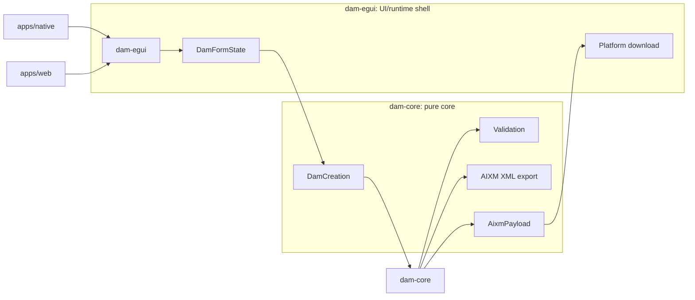

# Architecture

DAM Creation Tool is a small layered Rust egui application.

## Crates

- `dam-core`: pure application core. Contains the DAM model, catalog parsing,
  validation, distribution data, and AIXM payload generation.
- `dam-egui`: shared egui UI used by both native and web targets.
- `apps/native`: native launcher.
- `apps/web`: WASM launcher.

## Data Flow

Editable UI state lives in `DamFormState`.

When the user previews or downloads the form:

1. `DamFormState` is parsed into `DamCreation`.
2. `dam-core` validates the `DamCreation` and export readiness.
3. `dam-core` converts it into legacy SKYVISU-compatible AIXM XML.
4. `dam-egui` previews or downloads the generated payload.

The UI must not generate AIXM directly. If the AIXM preview has an active edited
XML draft, `dam-egui` validates that the draft is well formed and packages it as
the active download payload without mutating the form state.

## AIXM Export

AIXM XML generation lives in `dam-core::export::aixm`. The V1 generator emits
legacy SKYVISU-compatible creation XML:

- predefined maps use the selected `mapId`;
- predefined and manual names export uppercase;
- predefined map fallback geometry uses the first polygon/ring parsed from the
  selected GeoJSON map, falling back to the static hardcoded geometry when no
  polygon/ring exists;
- predefined fallback label position uses the first GeoJSON point or geometry
  center;
- manual polygon and strip geometry use repeated `gml:pos`;
- manual polygon and pie/circle arcs use `gml:ArcByCenterPoint`;
- para and text/number export empty geometry segments;
- non-zero manual lateral buffers export original geometry first and buffered
  geometry second;
- manual maps use `mapId=0`;
- `sliceId` is emitted as `0`;
- all activation periods are exported as timesheets.

Unsupported visible state is rejected as field-specific validation issues
rather than silently generating operationally misleading XML.

## Schema

## Boundaries

- `dam-core` must not depend on `egui`, `eframe`, `walkers`, `web-sys`, HTTP
  clients, or filesystem APIs.
- `dam-egui` may depend on `egui`, `eframe`, `walkers`, and platform/runtime
  helpers.
- Native/WASM launcher crates should stay thin.
