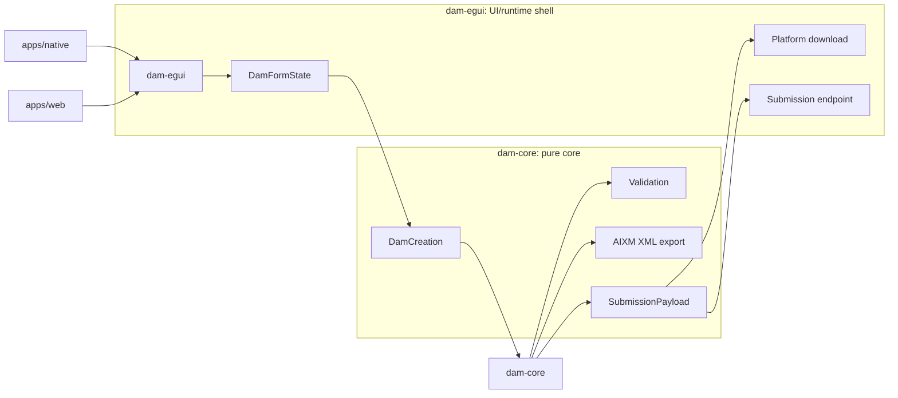

# Architecture

DAM Creation Tool is a small layered Rust egui application.

## Crates

- `dam-core`: pure application core. Contains the DAM model, catalog parsing,
  validation, distribution data, and export/submission payload generation.
- `dam-egui`: shared egui UI used by both native and web targets.
- `apps/native`: native launcher.
- `apps/web`: WASM launcher.

## Data Flow

Editable UI state lives in `DamFormState`.

When the user sends or exports the form:

1. `DamFormState` is parsed into `DamCreation`.
2. `dam-core` validates the `DamCreation`.
3. `dam-core` converts it into AIXM XML.
4. `dam-egui` downloads or submits the generated payload.

The UI must not generate AIXM directly. If the AIXM preview has an active edited
XML draft, `dam-egui` validates that the draft is well formed and packages it as
the active submission/download payload without mutating the form state.

## AIXM Export

AIXM XML generation lives in `dam-core::export::aixm`. The current generator is
intentionally small and mirrors the existing TypeScript DAM builder shape:

- predefined maps use the selected `mapId`;
- predefined map fallback geometry uses the first polygon/ring parsed from the
  selected GeoJSON map, falling back to the static hardcoded geometry when no
  polygon/ring exists;
- predefined fallback label position uses the first GeoJSON point;
- manual polygon maps use the drawn geometry as one `gml:posList` in
  longitude/latitude order;
- manual maps use `mapId=0`;
- `sliceId` is currently emitted as `0`;
- only one activation period is supported for now;
- manual lateral-buffer geometry is not emitted yet.

Unsupported AIXM cases return typed `AixmExportError` values rather than
silently generating operationally misleading XML.

## Schema

## Boundaries

- `dam-core` must not depend on `egui`, `eframe`, `walkers`, `web-sys`, HTTP
  clients, or filesystem APIs.
- `dam-egui` may depend on `egui`, `eframe`, `walkers`, and platform/runtime
  helpers.
- Native/WASM launcher crates should stay thin.
